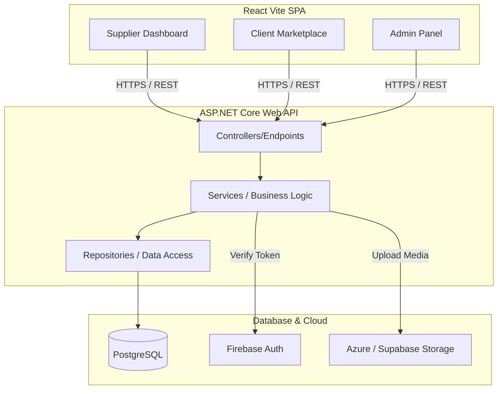

  <h1>🚀 B2B Marketplace Platform</h1>
  
<strong>A Modern, Multi-Tenant B2B E-Commerce & Supplier Portal</strong>

  
  
  
  

 

> [!WARNING]
> **Source Code Status:**
> To protect proprietary business logic, the repository implementations have been removed from this public showcase. The architecture, entities, interfaces, and controllers remain visible to demonstrate code quality and structure. **The full source code with enterprise logic is available for purchase/licensing.**

---

## 🌟 Key Features

### 🏢 Supplier Portal
- **Dashboard Analytics**: Real-time insights into product performance and orders.
- **Product Management Engine**: Advanced tier-based limit validation (e.g., max 10 free products, auto-upgrades).
- **Media Hosting**: Secure Azure / Supabase integration for seamless image uploads.

### 🛒 Client Marketplace
- **B2B Procurement**: Streamlined buying flows for enterprise clients.
- **Smart Search & Filters**: Efficient product discovery across categories.

### 🔐 Security & Architecture
- **Clean Architecture**: Strictly layered .NET backend (Controllers -> Services -> Repositories -> Entities).
- **Firebase Auth**: Robust login flows with Google Sign-in and OTP email validation.
- **JWT Authorization**: Fine-grained role-based access control (Admin, Supplier, Client).

### 🏗️ System Architecture

---

## 🛠️ Technology Stack

**Backend:**
- C# / .NET 8 Web API
- Entity Framework Core
- PostgreSQL

**Frontend:**
- React (Vite)
- Tailwind CSS
- Axios

**Cloud & Infrastructure:**
- Firebase (Authentication)
- Supabase / Azure (Blob Storage)
- MailKit / SMTP

---

## 💼 Commercial Licensing & Full Source Code

This project is a premium enterprise-grade solution. If you are interested in purchasing the full source code (with all business logic implementations), hiring me to customize this platform for your business, or discussing job opportunities, please get in touch:

📫 **Contact me on GitHub or via email (Please check my GitHub profile for contact details).**

---

  
<i>Designed & Developed with ❤️</i>

